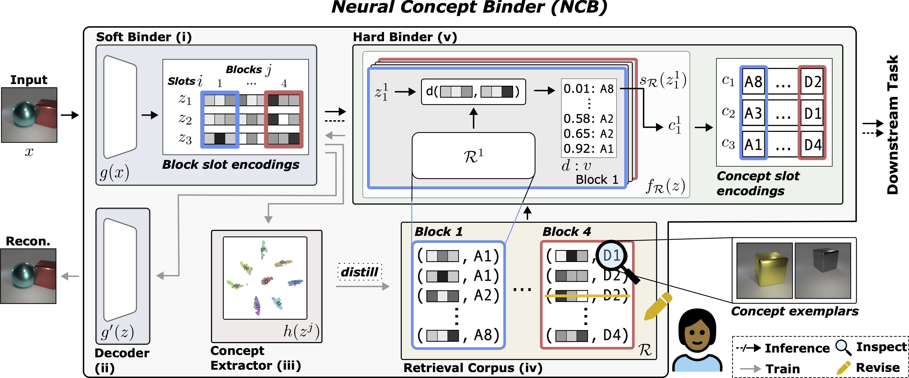

# NeuralConceptBinder

This is the official repository of the "Neural Concept Binder" article.
This repository contains all source code required to reproduce the experiments of the paper. 



## How to Run:

### Datasets

Here we provide information on how to download the novel and evaluated datasets.

We provide our novel CLEVR-Sudoku dataset [here](https://hessenbox.tu-darmstadt.de/getlink/fi5RUb2R7UobPiFBzorpEYPT/CLEVR_SUDOKU.zip).

For the CLEVR-Easy dataset we refer to <https://github.com/singhgautam/sysbinder>.

We provide the used CLEVR dataset [here](https://hessenbox.tu-darmstadt.de/getlink/fiTkYuSoR2VvA2JLj7EACkxo/CLEVR-4.zip).

We provide the datasets used to finetune NCBs hard binder (i.e., distill the concepts) at:
[CLEVR-Easy-1](https://hessenbox.tu-darmstadt.de/getlink/fiHHPQ537ViPaxdz6vD7e2d5/CLEVR-Easy-1.zip) 
and [CLEVR-1](https://hessenbox.tu-darmstadt.de/getlink/fiVCLMaZkEuf5f6HYG58sshV/CLEVR-4-1.zip).

These represent versions of the original datasets that contain single objects.

Please visit the [CLEVR-Hans](https://github.com/ml-research/CLEVR-Hans) repository for instructions on how to download 
the CLEVR-Hans dataset.

### Model Checkpoints

We provide checkpoints of all trained models of our experiments as well as parameter files for [CLEVR-Easy](https://hessenbox.tu-darmstadt.de/getlink/fiNmsxY8anr52RGTwsQtzSxW/CLEVR-Easy.zip)
and [CLEVR](https://hessenbox.tu-darmstadt.de/getlink/fi6WzuWtQ87Px5P3ewEVNQyZ/CLEVR-4.zip). 

### Docker

We have attached a Dockerfile to make reproduction easier. We further recommend to build your own docker-compose file
based on the DockerFile. To run without a docker-compose file:

1. ```cd src/docker/```

2. ```docker build -t neuralconceptbinder -f Dockerfile .```

3. ```docker run -it -v /pathto/NeuralConceptBinder:/workspace/repositories/NeuralConceptBinder -v /pathto/CLEVR-4-1:/workspace/datasets/CLEVR-4-1 --name neuralconceptbinder --entrypoint='/bin/bash' --runtime nvidia neuralconceptbinder```

Once the docker container has been generated, within the docker container please run these steps:

```
cd to “pathto/NeuralConceptBinder/“
run “pip install -e sysbinder”
```

### Evaluations

The folder ```scripts/``` contains bash scripts for training all models and for evaluations for Q1. Files for
training the soft binder are in ```scripts/train/CLEVR-4/``` and ```scripts/train/CLEVR-Easy/```. For finetuning the
hard binder and obtaining the retrieval corpus we refer to ```scripts/train/perform_block_clustering.sh```. 
The scripts for Q1 evaluations are in ```scripts/eval/```.

We provide a notebook for the different inspection procedures in ```inspection.ipynb```.

```clevr_puzzle/``` contains the code to generate the CLEVR-SUDOKU dataset and run the evaluation code (Q2)

We provide notebooks for GPT-4 based revision evaluations in ```revise_via_gpt4/``` and notebooks for simulated 
human-based revision evaluations in ```revise_via_user/``` in the context of Q3.

```clevr_hans/``` contains the code relevant for our evaluations on subsymbolic computations based on 
the CLEVR-Hans dataset in the context of Q4.

```data_creation_scripts/``` contains the json files used for creating the CLEVR-Easy-1 and CLEVR-1 datasets
based on the CLEVR-Hans repository.